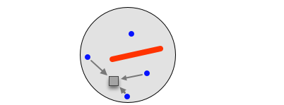

<script type="text/x-mathjax-config">
MathJax.Hub.Config({
  TeX: { 
      equationNumbers: {
            autoNumber: "all",
      } 
  }
});
</script>

<!-- https://groups.google.com/forum/#!topic/knitr/OMvT03PtGPM --> 

```{r initial_chunk, echo = FALSE, warning = FALSE, message = FALSE}
library("knitr")
opts_chunk$set(echo = FALSE, eval = TRUE, warning = FALSE, message = FALSE, vcache = FALSE, fig.align = 'center', dpi = 300, out.width = '75%', fig.width = 9)
```

```{r set-up}
library("cowplot") # Export plots
library("data.table") # Fast dataset manipulation
import::from("fields", "rdist") # rdist function
library("geoR") # Analysis of geo-statistical data
library("ggplot2") # Data visualisations using the Grammar of Graphics
library("ggrepel") # Text labels
library("gstat") # Geo-statistical modelling
library("kableExtra") # Table output formatting
library("magrittr") # Pipe operators
library("progress") # Progress bars
library("stringi") # String manipulation
source("../src/helpers.R") # Load custom functions

# Set default ggplot theme
theme_set(
  theme_light(
  base_size = 12
  ) +
  theme(
    text = element_text(family = "Gibson", colour = "gray10"),
    panel.border = element_blank(),
    axis.line = element_line(colour = "gray50", size = .5),
    # axis.ticks = element_blank(),
    strip.background = element_rect(colour = "gray50", fill = "transparent", size = .7),
    strip.text.x = element_text(colour = "gray10"),
    strip.text.y = element_text(colour = "gray10"),
    legend.key.size = unit(.7, "cm")
  )
)

# Set default scales
scale_colour_continuous <- function(...) ggplot2::scale_colour_viridis_c(..., option = "viridis")
scale_colour_discrete <- function(...) ggplot2::scale_colour_viridis_d(..., option = "viridis")
scale_fill_continuous <- function(...) ggplot2::scale_fill_viridis_c(..., option = "viridis")
scale_fill_discrete <- function(...) ggplot2::scale_fill_viridis_d(..., option = "viridis")

options(geoR.messages = FALSE)
```

# Introduction

Spatial interpolation is the process of using points with known values to estimate values at other points ([QGIS definition](https://docs.qgis.org/3.10/en/docs/gentle_gis_introduction/spatial_analysis_interpolation.html)). When asked a question like _What is the air pollutants concentration over the entire city?_ and you only have access to measures at some observation stations, the answer is *spatial interpolation*. 

There are many use cases, depth maps, concentration of mineral resources in the soil of a region, air pollution, elevation map .... The common point is that the information of interest (altitude, concentration ...) is known at sample points and one wants to know it at every point of a specific region. 

There exists different solutions to this spatial interpolation problem. They often consist on taking a weighted average of the sample points. In this document 3 methods are presented:

* Inverse Distance Weighting (IDW), 
* Triangular Irregular Networks (TIN), 
* Kriging

#### The mathematical problem

Before going into detail on the way these methods work, let's give a proper mathematical definition of the problem.

Let's say you have $n$ measures $z_1, \dots, z_n$ of some variable $Z$ at $n$ points in some region of space $R \subset \mathbb{R}^2$. You want to know the value of $Z$ at every points in that region $R$. $Z$ could be the concentration in some minerals and $R$ a mining region.

The ultimate goal is to define a function that for each point $(x, y) \in R$ associates a value $z \in \mathbb{R}$.

$$
f \ : \ (x, y) \in R \rightarrow z \in \mathbb{R}
$$
Finding this function is what spatial interpolation is about. To do so the only input data at your disposal are the $n$ estimates at sample points $s_1, \dots , s_n$, $s_i \in R, i = 1 \dots n$. 

Different methods exist [see @overview ; and @KrigeageThese] and most of them have the same general formula. The prediction at a point $s_0 \in R$ of the variable $Z$, $\widehat{Z_{s_0}}$, is given by the following relation:

<a id="the-equation"></a>
$$
\widehat{Z_{s_0}} = \sum_{i = 1}^{n}\lambda_i z_{s_i}
$$

The predictions are a weighted average of the values observed at sample points $s_1, \dots , s_n$. The way the weights $\lambda_1, \dots , \lambda_n$ are defined is what make each method different from the others. However weights are defined, every method follows the [Tobler's first law of geography](https://en.wikipedia.org/wiki/Tobler%27s_first_law_of_geography) that states that _"everything is related to everything else, but near things are more related than distant things"_. In other words points that are close to the prediction point will have a higher weight than far away points. 

Some methods are deterministic, meaning you don't get a confidence interval whereas others are stochastic, considering the values $z_1, \dots, z_n$ to be realisations of random variables $Z_1, \dots, Z_n$.

#### The application

The methods will be explained theoretically and code will be provided to apply them on toy data. Although the aim of this document is not to compare each method, as choosing the best one depends on the data, the same example data will be used throughout the document. The data we will use consists of a gaussian random field simulated on a $[0, 1] \times [0, 1]$ grid with the `geoR::grf()` function. A random sample of 100 points are selected and will be used as the basis for the spatial interpolation. Besides this pretty simple scenario, additional use cases will be explored. 

<a id="grf"></a>
```{r grid, out.width="100%"}
simulated_grid <- readRDS("../data/grf_spheric_01x01.rds")
set.seed(123)
sample_points <- simulated_grid[sample(1:10201, 100), ]
plot_map(simulated_grid, "The 100 sample points on the true map") +
  geom_point(
    data = sample_points,
    mapping = aes(x = x, y = y),
    size = 1
  )
```


# Inverse Distance Weighting

The first method that we'll explore is IDW. It uses [this equation](#the-equation) to make the predictions and the weights are defined using, you guessed it, the inverse of the distance to sample points.

After explaining the how, 2 applications with R code are provided, a really basic one to illustrate the theory and a more challenging one, where barriers are added, but we'll come to that later. 

## How it works

First let's dive into the method. The weights $\lambda_1, \dots , \lambda_n$ are defined by taking the inverse of the distance between the point to predict, $s_0$, and the sample points $s_1, \dots , s_n$, at a specific power $p$. This method directly considers that the closer a point is to another the more alike they are. If $dist(a, b) = ||a-b||^2$ is the euclidean distance between points $a, b \in \mathbb{R}^2$ then for $s_0 \in R$, $\forall i = 1\dots n$ and $p \in \mathbb{N}$, the weights $\lambda_1, \dots , \lambda_n$ are defined with the following equation.

<a id="idw-weight"></a>
$$
\lambda_i = \frac{\left(dist(s_0, s_i)^p\right)^{-1}}{\left(\sum_{j=1}^{n}dist(s_0, s_j)^p\right)^{-1}}
$$

The weights are normalized by the sum of all weights so they sum to 1. This also removes the dependence from the unit (metres or km). The parameter $p$ defines the rate at which the influence of a point to another decreases. The higher $p$ is the fastest the decrease of influence is.

```{r power}
x_seq <- seq(0, 10, length.out = 11)
data <- data.table(
    x = rep(x_seq, 5),
    y = c(1 / x_seq^0, 1 / x_seq^1, 1 / x_seq^2, 1 / x_seq^3, 1 / x_seq^4),
    color = rep(as.character(0:4), each = 11)
  ) %>% 
  .[x == 3, label := paste("p =", color), by = color]
ggplot(
  data = data, 
  mapping = aes(x = x, y = y, color = color, group = color)
) + 
  geom_line(
    show.legend = FALSE
  ) + 
  scale_x_continuous(
    breaks = seq(0, 10, length.out = 6)
  ) + 
  geom_label_repel(
    mapping = aes(label = label),
    nudge_x = 1,
    show.legend = FALSE
  ) + 
  labs(
    x = "Distance",
    y = latex2exp::TeX("$1 / x^p$"),
    title = "Comparison of different power orders"
  )
```

$p$ is an hyper-parameter of the IDW method and the most adequate value should be selected. One solution to this problem will be presented in a [dedicated section](#p-choice) later.

## A first application

First let's apply IDW on our [simulated random field](#grf). Recall we have 100 points and we want to predict the value of the variable of interest $Z$ for every point of the grid $[0, 100] \times [0, 100]$.

Building the interpolated map means making a prediction for each point in the grid. Following formula 2 and 3 we need to:

1. compute the distance matrix between each point and the sample points
2. use these distances to build the weights
3. build our prediction according to equation 2 $\widehat{Z_{s_0}} = \sum_{i = 1}^{n}\lambda_i Z_{s_i}$

### Step by step code {#idw-step-by-step}

The process to make predictions on the grid is presented in the following code. Of course specific functions exist to do just that but let's break it piece by piece first. 

The order used here is 5, we will see later on how this value was selected.

```{r idw_base, echo = TRUE}
# Distance matrix
distance <- rdist(simulated_grid[, c("x", "y")], sample_points[, c("x", "y")])

# Weights matrix
# Take the inverse of every element of the distance matrix
weights <- apply(
  X = distance,
  MARGIN = 1:2,
  FUN = function(x) 1 / x^5
)
# Divide (FUN = "/") the weights by the row sum (STATS = rowSums(weights)) to every element of the
# weights matrix (x = weights) row wise (MARGIN = 1)
weights <- sweep(
  x = weights,
  MARGIN = 1,
  STATS = rowSums(weights),
  FUN = "/"
)

# Multiply the weights matrix with the z value of the sample points
pred <- weights %*% sample_points$z
```

Those lines of code are the only ones needed to have an estimated $Z$ value at each location of the grid $[0, 100] \times [0, 100]$. The result, `pred`, is a table with $101 \times 101 = 10201$ values, one for each point of the grid. The following figure displays the predicted map alongside the true data.

```{r idw_pred_map}
type_lables <- c("IDW map", "Real map")
names(type_lables) <- c("pred", "true")
data.table(simulated_grid[, c("x", "y")], "pred" = pred[, 1], "true" = simulated_grid$z) %>%
  merge(
    y = sample_points,
    by = c("x", "y"),
    all.x = TRUE
  ) %>%
  .[is.na(pred), pred := z] %>%
  .[, z := NULL] %>%
  melt(
    id.vars = c("x", "y"),
    variable.name = "type",
    value.name = "z"
  ) %>%
plot_map("Prediction with IDW and real data") +
  facet_grid(
    cols = vars(type),
    labeller = labeller(type = type_lables)
  ) +
  theme(
    strip.text = element_text(size = 12),
    panel.spacing = unit(2.5, "lines")
  )
```

The map is globally the same (if you're not too exigent) but much smoother than the real one. It displays some "bubbles" around the sample points which is of course coherent with the fact that each point has a strong influence only on its immediate neighbourhood (recall $p$ was set to 5).

### How to chose $p$? {#p-choice}

The order $p$ was set to 5. Why not 3 or 6 or even 10? The choice of $p$ depends on the data you have and one should always try to find the most appropriate value. One way to do so is to evaluate the error of prediction using a leave-one-out estimation. For each point in the sample a prediction is made using all the other points. The estimation of the error is then the average error observed. 

More specifically if we have $n$ points $s_1, \dots, s_n$, the leave-one-out error estimation is computed as follows:

$$
\begin{equation}
\begin{split}
E_{LOO} &= \sqrt{\frac{1}{n} \sum_{i=1}^{n}(Z_{s_i} - \widehat{Z_{s_i}})^2} \\
\widehat{Z_{s_i}} &= \sum_{j=1, j \ne i}^{n}\lambda_j Z_{s_j}
\end{split}
\end{equation}
$$

The weights are computed as defined in [equation 3](#idw-weight). This error is computed for different values of $p$ and the value of $p$ that minimizes the error is to be chosen. 

The following piece of code illustrates this method. The error is estimated for $p = 1\dots 20$.

```{r loo, echo = TRUE}
rmse_errors <- sapply(
  X = 1:20, # Values of p
  FUN = function(p) { # Compute the RMSE estimation for each value of p
    pred_sample <- numeric(length = 100)
    for (i in length(pred_sample)) {
      # Predict point i and remove it from sample points
      distance <- rdist(sample_points[i, c("x", "y")], sample_points[-i, c("x", "y")])
      weights <- apply(
        X = distance,
        MARGIN = 1:2,
        FUN = function(x) 1 / x^p
      )
      weights <- sweep(
        x = weights,
        MARGIN = 1,
        STATS = rowSums(weights),
        FUN = "/"
      )
      pred_sample[i] <- weights %*% sample_points[-i, ]$z %>% as.numeric()
    }
    return(sqrt(sum((pred_sample - sample_points$z)^2) / nrow(sample_points)))
  }
)
```


```{r loo_plot}
ggplot(
  data = data.frame(x = 1:20, y = rmse_errors),
  mapping = aes(x = x, y = y)
) +
  geom_line() +
  labs(
    x = "Power order",
    y = "Leave-one-out RMSE",
    title = "RMSE for different orders p"
  )
```


The RMSE (estimated with leave-one-out) first decreases a lot and reach a plateau around 5. The actual best value is `r which.min(rmse_errors)` but from this plot one can see that choosing 5 or 20 does not make a huge difference.


### Of course an idw function exists

The package `gstat` has an `idw()` function that does exactly what we did. It takes 5 arguments: 

* `formula` a formula giving the name of the target variable. For IDW the right hand side is 1, meaning no independent variables.
* `locations` a formula giving the names of the coordinates variables.
* `data` the name of the dataset containing the variables defined in `formula` and `locations`.
* `newdata` a table with the coordinates where to make predictions.
* `idp` the power order to use.

```{r idw, echo = TRUE, eval = FALSE}
pred_gstat <- idw(
  formula = z ~ 1,
  locations = ~ x + y,
  data = sample_points,
  newdata = simulated_grid[, c("x", "y")],
  idp = 5
)
```

```{r idw2, echo = FALSE}
pred_gstat <- idw(
  formula = z ~ 1,
  locations = ~ x + y,
  data = sample_points,
  newdata = simulated_grid[, c("x", "y")],
  idp = 5,
  debug.level = 0
)
```

As a sanity check let's compare the map obtained from the code of the [previous section](#idw-step-by-step) and the one with `gstat::idw()`.

```{r idw_sanity}
names(pred_gstat) <- c("x", "y", "z", "var")
data.table(simulated_grid[, c("x", "y")], "idw_base" = pred[, 1], "idw_gstat" = pred_gstat$z) %>%
  merge(
    y = sample_points,
    by = c("x", "y"),
    all.x = TRUE
  ) %>%
  .[is.na(idw_base), idw_base := z] %>%
  .[, z := NULL] %>%
  melt(
    id.vars = c("x", "y"),
    variable.name = "type",
    value.name = "z"
  ) %>%
  plot_map("Step by step and gstat IDW produce the same maps") +
  facet_grid(
    cols = vars(type),
    labeller = labeller(type = c("idw_base" = "Step by step", "idw_gstat" = "gstat::idw()"))) +
  theme(
    strip.text = element_text(size = 12),
    panel.spacing = unit(2.5, "lines")
  )
```

## Adding some spatial constraints

```{r barriers_data}
barriers <- readRDS("../data/barriers.rds")
points <- readRDS("../data/points.rds")
```

So far we considered that each sample point influences every point of the region (even if this influence could be small depending on the distance). In the presence of barriers (obstacles blocking the underlying physical process, causing linear discontinuity in the surface) some points can have no influence at all. When interpolated a value in a coastal region, we often encounter such barriers, (islands, port docks, ...).

To account for the presence of such barriers the interpolation algorithm must be modified. One can no longer use euclidean distance between all points to make a prediction. A first solution is to remove sample points that are not in the _line of sight_ of the point to predict.

```{r line-of-sight, fig.cap = "Source = [ArcGIS blog on esri.com](https://www.esri.com/arcgis-blog/products/analytics/analytics/interpolation-in-the-presence-of-barriers/)"}

```

Whenever a sample point is not in line of sight of the point to predict then its value is not used (its weight is set to 0) for the interpolation.

Another method, called Inverse Path Distance Weighting (IPDW) could also be used [see @ipdw]. It creates a cost surface and shortest path to define the distance between points. [This vignette](https://cran.r-project.org/web/packages/ipdw/vignettes/ipdw2.html), from the `ipdw` package [see @ipdw-package] explained the process.

A different toy data is used in this section.

```{r barrier_data_plot}
ggplot() + 
  geom_sf(data = barriers) + 
  geom_point(
    data = points,
    mapping = aes(x = x, y = y)
  ) + 
  geom_rect(
    mapping = aes(xmin = 0, xmax = 1, ymin = 0, ymax = 1),
    color = "grey20",
    fill = NA
  ) + 
  # expand_limits(
  #     x = c(-0.1, 1.1),
  #     y = c(-0.1, 1.1)
  #   ) +
  labs(
    title = "Region to interpolate with sample points and barriers"
  ) + 
  theme(
    panel.grid = element_blank(),
    axis.line = element_blank(),
    axis.text = element_blank(),
    axis.title = element_blank()
  )
```

We detail here how the first solution could be implemented. The idea is to update the weights matrix (as defined in [this section](#idw-step-by-step)) by setting to 0 weights between points that are not in _line of sight_. This piece of code is quite slow and only serves as explanatory purpose.

```{r constained_idw, echo = TRUE, eval = FALSE}
# First compute the distance matrix between all points of the grid and all sample points
distance <- rdist(simulated_grid[, c("x", "y")], points[, c("x", "y")])

# Define the power order
p <- 5

# Take the inverse of every element
weights <- apply(
  X = distance,
  MARGIN = 1:2,
  FUN = function(x) 1 / x^p
)

#### The weights update

# Remove connection that are not in "line of sight". For each pair of point build a line and check
# wether it crosses a barrier
to_remove <- matrix(FALSE, nrow = nrow(weights), ncol = ncol(weights))
for (i in seq_len(nrow(simulated_grid))) {
  for (j in seq_len(nrow(points))) {
    # Build the line between a sample point and the point to predict
    to_remove[i, j] <- rbind(as.numeric(points[j, c("x", "y")]), as.numeric(simulated_grid[i, c("x", "y")])) %>%
      st_linestring() %>%
      # Check whether it crosses a barrier
      st_intersects(barriers) %>%
      lengths() > 0
  }
}
weights[to_remove] <- 0

####

# Divide (FUN = "/") the weights by the row sum (STATS = rowSums(weights)) to every element of the
# weights matrix (x = weights) row wise (MARGIN = 1)
weights <- sweep(
  x = weights,
  MARGIN = 1,
  STATS = rowSums(weights),
  FUN = "/"
)

# Multiply the weights matrix with the z value of the sample points
pred <- weights %*% points$z
```

The resulting map is given in the following figure along with the map obained with regular IDW. 

```{r idw_constained_plot}
# Interpolation with IDW
pred_idw <- idw(
  formula = z ~ 1,
  locations = ~ x + y,
  data = points,
  newdata = simulated_grid[, c("x", "y")],
  idp = 5
)
names(pred_idw) <- c("x", "y", "z", "var")
# Load results from constained IDW
pred <- readRDS("../output/pred_idw_barriers.rds")
# Plot the result alongside the IDW prediction
data.table(simulated_grid[, c("x", "y")], "pred" = pred[, 1], "idw" = pred_idw$z) %>%
  merge(
    y = points,
    by = c("x", "y"),
    all.x = TRUE
  ) %>%
  .[is.na(pred), pred := z] %>%
  .[, z := NULL] %>%
  melt(
    id.vars = c("x", "y"),
    variable.name = "type",
    value.name = "z"
  ) %>%
  plot_map("Prediction with IDW and constrained IDW") +
  geom_sf(data = barriers) +
  facet_grid(
    cols = vars(type),
    labeller = labeller(type = c("pred" = "Constrained IDW", "idw" = "Regular IDW"))
  ) +
  theme(
    strip.text = element_text(size = 12),
    panel.spacing = unit(2.5, "lines")
  )
```

The impact of taking the barrier into account clearly appears. The interpolated values south of the bottom left barrier have lower values in the constrained IDW case. The barrier blocks the influence of the point north of that barrier to go beyond it. The difference _Constrained - Regular IDW_ is plotted on this figure.

```{r barrier_reg_plot}
data.table(simulated_grid[, c("x", "y")], "pred" = pred[, 1], "idw" = pred_idw$z) %>%
  merge(
    y = points,
    by = c("x", "y"),
    all.x = TRUE
  ) %>%
  .[is.na(pred), pred := z] %>%
  .[, z := pred - idw] %>%
  plot_map("Difference between the constrained IDW and the regular one") + 
  geom_sf(data = barriers)
```

We clearly see that the barriers prevent the high values located in the north-west part of the region to extend beyond the barriers. 

# Triangulated irregular network

[Delaunay traingulation](http://www.cs.uu.nl/geobook/interpolation.pdf)

# Kriging

Kriging is another method used to perform spatial interpolation. Unlike the previous one it is stochastic (a confidence interval is also computed with the prediction).

Before explaining the method, some concepts must be defined: random field, stationarity and variogram.

#### Random field

We consider each value $z_{s_1}, \dots, z_{s_n}$ to be observations of the random variables $Z_{s_1}, \dots, Z_{s_n}$, this is what makes Kriging a stochastic method. A random field, or random function, is simply a set of random variables. $Z_s = (Z_{s_1}, \dots, Z_{s_n})$ is a random function, or random field. $s$ represents a set of positions in space.

#### Stationarity

There are 3 kinds of stationarity: the strict stationarity, the second-order stationarity and the intrinsic stationarity. Refer to [@stationarity] for more information. [This document](https://informatique-mia.inra.fr/sites/informatique-mia.inra.fr.biosp-d7/files/oldfiles/geostat_janv12.pdf) (in French) also provides a nice definition of the concepts that are used in Kriging. 

The intrinsic stationarity is the only one used in ordinary Kriging so we will be defining only this one. Refer to [the Annexe](#kriging-math) for the definition of the other types of stationarity.

##### The intrinsic stationarity

A random function is said to have intrinsic stationarity if the following two conditions are met:

$$
\begin{equation}
\begin{split}
\mathbb{E}[Z_{s+h} - Z_s] = 0 \\
V(Z_{s+h} - Z_s) = 2\gamma(h)
\end{split}
\end{equation}
$$
The condition is no longer on the random field $Z_s$ itself but rather on the increments $Z_{s+h} - Z_s$. The function $\gamma(h)$ is the semi-variogram function. 

The second-order stationarity implies the intrinsic one. The reverse is not true. 

Stationarity is more like a model assumption than an hypothesis to be tested. It is a way to simplify the model we use to describe our data. As there is only one observation by random variables, stationarity assumptions are required to do any modelling. It is better to have as little assumptions as possible on the data structure to build our model, the ordinary Kriging relies on the least heavy one, that is the intrinsic stationarity. 

#### Variogram

In the definition of intrinsic stationarity, the function $\gamma(h)$ was introduced. It is the semi-variogram. Out of the covariance function, the auto-correlation function and the variogram, the latter is the most often used as it relies on the least restrictive hypothesis of stationarity. 

It is a function that only depends on $h$, the distance between 2 points, and that describes the spatial dependence of a random field. It measures how much 2 locations separated by $h$ will vary in their $z$ value. Under the assumption of intrinsic stationarity on $Z$ the variogram $\gamma(h)$ is defined by: 

$$
\begin{equation}
\begin{split}
\gamma(h) & = \frac{1}{2}V(Z_{s+h} - Z_{s}) \\
 & = \frac{1}{2} \left( \mathbb{E}\left[Z_{s+h} - Z_{s}\right]^2 - \mathbb{E}\left[\left(Z_{s+h} - Z_{s}\right)^2\right] \right)\\
 & = \frac{1}{2} \mathbb{E}\left[Z_{s+h} - Z_{s}\right]^2 - 0
\end{split}
\end{equation}
$$

Now that some basic concepts have been defined, let's dive into the Kriging method. We will be defining ordinary Kriging.

## How it works {#how-it-works-kriging}

The goal is to predict the $z$ value at a new location $s_0$. The Kriging formula is the same as the one used for the IDW method: $\widehat{Z_{s_0}} = \sum_{i = 1}^{n}\lambda_i Z_{s_i}$. We want to find the weights $\lambda_i$ required to predict the value $Z_{s_0}$.

[@KrigeageThese] gives a very precise explanation of the different Kriging methods. The mathematical details behind the Kriging model are given in the [Annexe section](#kriging-math), at the end of this document.

The weights are the solution to the following optimisation problem:

$$
\begin{equation}
\displaystyle \min_{\lambda_1, \dots, \lambda_n} V\left(\widehat{Z_{s_0}} - Z_{s_0}\right)\\
\textrm{s.t.} \sum_{i=1}^{n} \lambda_i = 1\\
\end{equation}
$$

The [Lagrange Multiplier](https://en.wikipedia.org/wiki/Lagrange_multiplier) $\mu$ is used to solve the optimisation problem. The zeros of the Lagrangian function $\mathcal{L}$ are the optimisation problem solutions.

$$
\mathcal{L}(\lambda_1, \dots, \lambda_n, \mu) = V\left(\widehat{Z_{s_0}} - Z_{s_0}\right) - 2 \mu\left(\sum_{i=1}^{n} \lambda_i - 1\right)
$$
The weights that minimise the Lagrangian function are given by the following expression. 

$$
\begin{bmatrix}
\lambda_1 \\ \vdots \\ \lambda_n \\ \mu
\end{bmatrix}
=
\begin{bmatrix}
\gamma(s_1-s_1) & \cdots & \gamma(s_1-s_n) &1 \\
\vdots & \ddots & \vdots  & \vdots \\
\gamma(s_n-s_1) & \cdots & \gamma(s_n-s_n) & 1 \\
1 &\cdots& 1 & 0 
\end{bmatrix}^{-1}
\begin{bmatrix}\gamma(s_1-s_0) \\ \vdots \\ \gamma(s_n-s_0) \\ 1\end{bmatrix}
$$
## How to do Kriging? 

Let's define the steps required to perform Kriging. From sample points, predicting the value at a new location requires 3 steps:

1. Define the empirical semi-variogram based on the sample points,
2. Fit a parametric semi-variogram on the empirical one,
3. Use the semi-variogram to define the Kriging weights and predict new values at unknown locations.

## Step-by-step code for Ordinary Kriging

In this section the code used to build an ordinary kriging model is given. The construction of the variogram needed to find the weights and the actual computation of the weights will be described. 

As for IDW the code will be detailed to explicitly show what is going on under the hood. This is for explanatory purpose only. The package [`geoR`](https://CRAN.R-project.org/package=geoR) contains higher-level functions to perform all the necessary steps of Kriging. The different higher-level functions that will be presented in this document comes from this package. The code for a complete Kriging model using functions from `geoR` will be presented as [the end of this section](#kriging-functions). 

### The semi-variogram

The semi-variogram is a key part of the Kriging model as it is used to compute the weights. It is then important to estimate it properly. First an empirical variogram is built, then a parametric one is fitted on it. 

A semi-variogram gives the strength of the association between 2 points based on the distance between them. The intuition is that when predicting the value at a new location, close points will have a stronger weight as their association strength is high. 

The semi-variogram is a function, $\gamma(h)$, that gives the semi-variance of 2 points separated by a distance $h$. The higher the value of the semi-variance, the lesser strong the association between the points. Our goal in this section is to build this function. First the empirical semi-variogram is built. The association strength is estimated as some distances, this forms a set of points on which a parametric model can be fitted. The parametric semi-variogram will be a function that takes one argument, the distance, and can be computed for every distances. 

#### The empirical semi-variogram

For a translation $h \in \mathbb{R}+$, $N_h = \left\{(s_i,s_j) : dist(s_i, s_j) = h; i,j = 1, \dots,n\right\}$ the set of points separated by distance $h$ and $|N_h|$ the number of points in this set, the empirical semi-variogram is defined by the following relation:

$$
\gamma(h) = \frac{1}{2|N_h|} \sum_{i=1}^{|N_h|}\left(Z_{s_{i+h}}-Z_{s_i}\right)^2
$$

Of course there won't be many pairs of points at exactly $h$ distance. So $N_h$ is actually defined as the set $\left\{(s_i,s_j) : dist(s_i, s_j) = h\pm \delta; i,j = 1, \dots,n\right\}$ with $\delta$ a tolerance range. In practice bins of distances are defined. 
To compute the empirical variogram we must start by calculating the value $\left(Z_{s_{i+h}}-Z_{s_i}\right)^2$ for every pair of points $(s_i, s_j), i,j = 1, \dots,n$.

```{r semi-variog-cloud, echo = TRUE}
vario_matrix <- outer(
  X = sample_points$z,
  Y = sample_points$z,
  FUN = function(x, y) (x - y)^2 / 2
)
```

```{r semi-variog-cloud-plot}
# Distance matrix between all points
dist_matrix <- dist(sample_points[, .(x, y)])

# Coerce matrix to long table so it is easier to plot later on (with the variogram)
dist_matrix <- dist_matrix %>%
  as.matrix() %>%
  as.data.table() %>%
  .[, point_a := 1:nrow(sample_points)] %>%
  melt(
    id.vars = "point_a",
    variable.name = "point_b",
    value.name = "distance"
  ) %>%
  .[, point_b := as.numeric(point_b)]

# Coerce to long table
vario_matrix <- vario_matrix %>%
  as.data.table() %>%
  setNames(as.character(1:nrow(sample_points))) %>%
  .[, point_a := 1:nrow(sample_points)] %>%
  melt(
    id.vars = "point_a",
    variable.name = "point_b",
    value.name = "semi_variance"
  ) %>%
  .[, point_b := as.numeric(point_b)]

# Build one table from distance and variogram
point_variogram <- merge(
  x = dist_matrix,
  y = vario_matrix,
  by = c("point_a", "point_b"),
  all = TRUE,
  sort = FALSE
)

# Visualisation of the variogram scatter plot
ggplot(
  data = point_variogram,
  mapping = aes(x = distance, y = semi_variance)
) +
  geom_point(
    alpha = .3
  ) +
  labs(
    x = "Distance",
    y = latex2exp::TeX("$\\frac{(Z_{s_i} - Z(s_j))^2}{2}$"),
    title = "Semi-variance by pair of points"
  )
```

The semi-variogram is computed using these points. Bins of distances are created and all the points inside each bin are averaged. The result is what we call the empirical semi-variogram. 
The first simple approach is to divide the distances into bins of equal width. This is simply obtained with the `cut()` function.

```{r semi-variog-cut1, echo = TRUE}
# Create classes of distance on which average semi variance will be computed
point_variogram[, group1 := cut(distance, 15)]
point_variogram[, x := define_center(group1)] # extract center of the class from 'cut' labels

# Compute the average semi-variance by distance group
empirical_variogram <- point_variogram[, .(count = .N, vario_mean = mean(semi_variance)), by = x]
```

The resulting points are visualised in the following figure. There is one point per group defined (15 in this case). The x-value of each point is the center of the distance bin, the y-value is the average of the $\left(Z_{s_{i+h}}-Z_{s_i}\right)^2$ value for each point in the bin. 

```{r semi-variog-cut1-plot}
plot_variogram(empirical_variogram)
```

There are several things one should pay attention to when analysing an empirical variogram: 

* the shape of the semi-variogram: recall the Tobler's first law of geography, distant things are less related than close ones. In the context of a variogram, it means that the semi-variance should be increasing with the distance. It is all the more true that when we will fit a parametric semi-variogram to the empirical one, the different models that we will use are all increasing with the distance. 
* the representativeness of each point: each point is the average of the value of all the points in the bin. If the number of points in the bin is too small or if the points have really different values then taking the point does not carry enough information.

Here the semi-variogram is not increasing with the distance, after 0.75. To evaluate the representativeness of each point we can plot the distribution of semi-variance by group using boxplots. 

```{r semi-variog-cut1-boxplot, fig.width=9}
plot_variogram_box(point_variogram, empirical_variogram)
```

We want the boxes to be as small as possible and to be all the same size. It is difficult to know when our choice of bin is good enough, there is not a single best choice.

Our second try at defining bins will consist in setting a max distance above which the semi-variance is not computed. This should solve the decreasing issue of our semi-variogram. We consider that 2 points separated by more than a specific value no longer don't influence each other and should not be taken into account when computing the semi-variogram. Besides the bins are constructed to be of equal size and not equal width. This is done using the function `ggplot2::cut_number()`. 

```{r semi-variog-cut2, echo = TRUE}
# Create evenly populated classes of distances
point_variogram[distance < .8, group3 := cut_number(distance, 10)]
point_variogram[, x := define_center(group3)]

# Compute the average semi-variance by distance group
empirical_variogram <- point_variogram[, .(count = .N, vario_mean = mean(semi_variance)), by = x]
```


```{r semi-variog-cut2-plot}
plot_variogram(empirical_variogram[!is.na(x)])
```

The semi-variogram is now increasing, on the distances of interest. Let's look at the distribution of each bins. 

```{r semi-variog-cut2-boxplot, fig.width=9}
plot_variogram_box(point_variogram[!is.na(x)], empirical_variogram[!is.na(x)])
```

By construction the bins all have the same number of points, the boxes are not too large. The most important part of a semi-variogram is its shape for low distances. Because usually only close points will have an impact on the prediction, it is important to have a good estimate of the association semi-variance at small distances. 

Our last try consists of bins that are smaller for small distances and then as before. 4 bins are defined for the first 15% of the data then 8 for the remaining 85%.

```{r semi-variog-cut3, echo = TRUE}
# Smaller groups at the beginning
point_variogram[distance < .8, group4 := cut(distance, breaks = quantile(distance, c(seq(0, .15, by = .05), seq(.2, 1, length.out = 9))))]
point_variogram[, x := define_center(group4)]

# Compute the average semi-variance by distance group
empirical_variogram <- point_variogram[, .(count = .N, vario_mean = mean(semi_variance)), by = x]
```


```{r semi-variog-cut3-plot}
plot_variogram(empirical_variogram[!is.na(x)])
```

The semi-variogram is now increasing, on the distances of interest. Let's look at the distribution of each bins. 

```{r semi-variog-cut3-boxplot, fig.width=9}
plot_variogram_box(point_variogram[!is.na(x)], empirical_variogram[!is.na(x)])
```

The four first bins contains less values than the other eight. The boxes are all quite small so this empirical semi-variogram is chosen as a basis for a parametric one. 

#### The parametric semi-variogram

Now that an empirical semi-variogram has been defined, it is possible to fit a parametric one on it. 

Parametric semi-variogam are pre-defined functions whose parameters are to be fitted on data. Different functions exist, 3 will be tested in this document, the gaussian one, the exponential one and the spheric one. 

```{r parametric-variog}
sigma <- 20
phi <- 100
nugget <- 0
x <- seq(0, 150, length.out = 1000)
vario_mod_spherical <- ifelse(
  test = x > phi,
  yes = nugget + sigma,
  no = nugget + sigma * (3 / 2 * (x / phi) - 1 / 2 * (x / phi)^3)
)
vario_mod_gaussian <- ifelse(
  test = x == 0,
  yes = 0,
  no = nugget + sigma * (1 - exp(-x^2 / (phi - 40)^2))
)
vario_mod_exponential <- ifelse(
  test = x == 0,
  yes = 0,
  no = nugget + sigma * (1 - exp(-x / (phi - 40)))
)
data.frame(
  x = rep(x, 3),
  y = c(vario_mod_spherical, vario_mod_gaussian, vario_mod_exponential),
  type = rep(c("Spherical", "Gaussian", "Exponential"), each = 1000)
) %>% 
  ggplot(
    mapping = aes(x = x, y = y, color = type)
  ) + 
  geom_line() + 
  labs(
    title = "Exemple of 3 parametric semi-variograms",
    x = "Distance",
    y = "Semi-variance",
    color = "Model"
  ) + 
  theme(
    legend.position = c(.8, .3)
  )
```

The functions are defined with 3 parameters:

* the sill $\sigma$ is the limit of the semi-variogram when $h \to \infty$.
* the range $\phi$ is the distance above which the semi-variance is close to the sill. By convention it is when 95% of the sill is obtained for semi-variogram with a sill (as some may tends towards $\infty$ when $h \to \infty$).
* the nugget $\gamma_0$ is the semi-variance when $h \to 0$. It represents the measurement error. Such parameter can be fitted like the other 2 but should probably be fixed by hand based on expertise on the process at stake. 

$$
\begin{gathered}
\text{Exponential : } \gamma(h) = \gamma_0 + \sigma^2\left[1 - \exp\left(-\frac{h}{\phi}\right)\right] \\
\text{Gaussian : } \gamma(h) = \gamma_0 + \sigma^2\left[1 - \exp\left(-\frac{h^2}{\phi^2}\right)\right] \\
\text{Spheric : } \gamma(h) = \begin{cases}
\gamma_0 + \sigma \ \text{ if } h > \phi\\
\gamma_0 + \sigma \left(\frac{3h}{2\phi} - \frac{1h^3}{2\phi^3}\right) \ \text{ else }
\end{cases}
\end{gathered}
$$
Other functions can be used but those are the most common ones. They convey a strong prior on the spatial dependance, there is a finite limit when $h \to \infty$. 

A numerical optimisation is used to fit the parameters. The function to minimise is the sum of squared errors between the parametric model values and the ones of the empirical semi-variogram. For instance, with $\gamma_1, \dots, \gamma_k$ the semi-variance of the $k$ bins $h_1, \dots, h_k$, the loss of the exponential model is:

$$
Loss(\gamma_0, \sigma, \phi) = \sum_{i=1}^{k}\left(\gamma_0 + \sigma^2\left[1 - \exp\left(-\frac{h_i}{\phi}\right)\right] - \gamma_i\right)^2
$$
We want the parameters $\gamma_0, \sigma, \phi$ that minimise the loss. Here we let $\gamma_0$ be adjusted as well. There are simply obtained with the `optim()` function. Here we specify a spherical model.

```{r variog_fit, echo = TRUE, eval = FALSE}
# Define the loss function needed for the optim function. It takes 3 arguments: the parameters
# to find, the distances and semi-variance of the empirical semi-variogram
loss_function <- function(params, x, vario_emp) {
  sigma <- params[1]
  phi <- params[2]
  nugget <- params[3]
  vario_mod <- ifelse(
      test = x > phi,
      yes = nugget + sigma,
      no = nugget + sigma * (3 / 2 * (x / phi) - 1 / 2 * (x / phi)^3)
    )
  loss <- sum((vario_emp - vario_mod)^2)
  return(loss)
}
spherical_param <- optim(
  par = c(2.2, .4, 0),
  fn = loss_function,
  x =  empirical_variogram$x[!is.na(empirical_variogram$x)],
  vario_emp = empirical_variogram$vario_mean[!is.na(empirical_variogram$x)]
)
```

The obtained parameters, the object `spherical_param`, can then be used to build the semi-variogram function.

```{r variog_func, echo = TRUE, eval = FALSE}
vario_func <- function(x) {
  sigma <- spherical_param$par[1]
  phi <- spherical_param$par[2]
  nugget <- spherical_param$par[3]
  return(ifelse(
      test = x > phi,
      yes = nugget + sigma,
      no = nugget + sigma * (3 / 2 * (x / phi) - 1 / 2 * (x / phi)^3)
    ))
}
```

The quality of adjustment of the 3 parametric semi-variograms to the empirical one can be assess visually and by looking at the loss value. 

```{r variog_fit_2}
loss_function <- function(params, x, vario_emp, cov_model) {
  sigma <- params[1]
  phi <- params[2]
  nugget <- params[3]
  if (cov_model == "spherical") {
    vario_mod <- ifelse(
      test = x > phi,
      yes = nugget + sigma,
      no = nugget + sigma * (3 / 2 * (x / phi) - 1 / 2 * (x / phi)^3)
    )
  } else if (cov_model == "gaussian") {
    vario_mod <- ifelse(
      test = x == 0,
      yes = 0,
      no = nugget + sigma * (1 - exp(-x^2 / phi^2))
    )
  } else if (cov_model == "exponential") {
    vario_mod <- ifelse(
      test = x == 0,
      yes = 0,
      no = nugget + sigma * (1 - exp(-x / phi))
    )
  }
  loss <- sum((vario_emp - vario_mod)^2)
  return(loss)
}

# Numeric optimisation to find the best parameters
gausian_param <- optim(
  par = c(2.2, .4, 0),
  fn = loss_function,
  x =  empirical_variogram$x[!is.na(empirical_variogram$x)],
  vario_emp = empirical_variogram$vario_mean[!is.na(empirical_variogram$x)],
  cov_model = "gaussian"
)
spherical_param <- optim(
  par = c(2.2, .4, 0),
  fn = loss_function,
  x =  empirical_variogram$x[!is.na(empirical_variogram$x)],
  vario_emp = empirical_variogram$vario_mean[!is.na(empirical_variogram$x)],
  cov_model = "spherical"
)
exponential_param <- optim(
  par = c(2.2, .4, 0),
  fn = loss_function,
  x =  empirical_variogram$x[!is.na(empirical_variogram$x)],
  vario_emp = empirical_variogram$vario_mean[!is.na(empirical_variogram$x)],
  cov_model = "exponential"
)
# Visualise the parametric variogram and the empirical one
vario_fit_data <- data.frame(
  x = rep(seq(0, .8, length.out = 1000), 3),
  type = rep(c("Exponential", "Gaussian", "Spherical"), each = 1000),
  y = c(
    exponential_param$par[3] + exponential_param$par[1] * (1 - exp(-seq(0, .8, length.out = 1000) / exponential_param$par[2])),
    gausian_param$par[3] + gausian_param$par[1] * (1 - exp(-seq(0, .8, length.out = 1000)^2 / gausian_param$par[2]^2)),
    ifelse(
      test = seq(0, .8, length.out = 1000) > spherical_param$par[2],
      yes = spherical_param$par[3] + spherical_param$par[1],
      no = spherical_param$par[3] + spherical_param$par[1] * (3 / 2 * (seq(0, .8, length.out = 1000) / spherical_param$par[2]) - 1 / 2 * (seq(0, .8, length.out = 1000) / spherical_param$par[2])^3)
    )
  )
)
plot_variogram(empirical_variogram[!is.na(x)]) +
  geom_line(
    data = vario_fit_data,
    mapping = aes(x = x, y = y, color = type)
  ) +
  guides(
    colour = guide_legend(override.aes = list(size = 2))
  ) +
  scale_colour_discrete(
    labels = c(
      "Exponential" = paste0("Exponential: ", round(exponential_param$value, 2)),
      "Gaussian" = paste0("Gaussian: ", round(gausian_param$value, 2)),
      "Spherical" = paste0("Spherical: ", round(spherical_param$value, 2))
    )
  ) + 
  labs(
    title = "3 parametric semi-variograms fitted on the empirical one",
    subtitle = "The loss value of each parametric model is given in the legend.",
    y = "Semi-variance",
    color = "Parametric model"
  ) +
  theme(
    legend.position = c(.8, .2)
  )
```

The exponential model has the lowest loss value. Nevertheless we want our semi-variogram to be precise on low distances and the gaussian and spherical ones seem to be better adjusted at lower distances. The exponential model has a better overall fit because it is closer to the last points on average. The spherical model is the one that will be selected for now on. 

### The Kriging weights

The Kriging weights, defined in the _how it works_ [section](#how-it-works-kriging), are computed for a new point $s_0$ with the following expression. $\mu$ is the Lagrange multiplier, coming from the optimisation resolution process.

$$
\begin{bmatrix}
\omega_1 \\ \vdots \\ \omega_n \\ \mu
\end{bmatrix}
=
\begin{bmatrix}
\gamma(s_1,s_1) & \cdots & \gamma(s_1,s_n) &1 \\
\vdots & \ddots & \vdots  & \vdots \\
\gamma(s_n,s_1) & \cdots & \gamma(s_n,s_n) & 1 \\
1 &\cdots& 1 & 0 
\end{bmatrix}^{-1}
\begin{bmatrix}\gamma(s_1,s_0) \\ \vdots \\ \gamma(s_n,s_0) \\ 1\end{bmatrix}
$$
Now that the function $\gamma$ is defined, computing the weights $\omega_1, \dots, \omega_n$ is simply a matter of matrix inversion and multiplication. 

The following piece of code does the weight computation for a single point. It starts by creating the needed matrix and vector and then performs the multiplication to obtain the weights.

```{r kriging-weights, echo = TRUE, eval = FALSE}
# Coordinates of the point s0 to predict
point_pred <- c(.5, .5)

# # Add row names to easily spot points
# rownames(sample_points) <- paste0("s", 1:nrow(sample_points))

# Distance matrix of s1,...sn and s0
matrix_dist <- as.matrix(sample_points[, c("x", "y")]) %>% # transform the coordinates into a matrix
  rbind("s_pred" = point_pred) %>% # add s0
  wordspace::dist.matrix(method = "euclidean") # compute the distance between all points

# Extract the distance between s0 and sample points s1,...,sn (distances needed to compute the vector)
predict_dist <- matrix_dist[1:100, 101]

# Remove distance with s0 (distances needed to compute the matrix)
sample_dist <- matrix_dist[1:100, 1:100]

# Function to compute the variogram
vario_func <- function(x) {
  return(ifelse(
    test = x > spherical_param$par[2],
    yes = spherical_param$par[3] + spherical_param$par[1],
    no = spherical_param$par[3] + spherical_param$par[1] * (3 / 2 * (x / spherical_param$par[2]) - 1 / 2 * (x / spherical_param$par[2])^3)
  ))
}

# Variogram matrix
variogram_matrix <- apply(
  X = sample_dist,
  MARGIN = c(1, 2),
  FUN = function(x) vario_func(x)
)

# Add the extra row and column of 1 (and 0 on last cell) to complete the matrix
variogram_matrix <- rbind(variogram_matrix, 1)
variogram_matrix <- cbind(variogram_matrix, 1)
variogram_matrix[nrow(variogram_matrix), ncol(variogram_matrix)] <- 0

# Inverse the matrix
variogram_matrix_inv <- solve(variogram_matrix)

# Variogram vector
variogram_vec <- vario_func(predict_dist)

# Add extra 1
variogram_vec <- c(variogram_vec, 1)

# Compute the vector of weights
weights <- variogram_matrix_inv %*% variogram_vec

# Compute the value at s0 by multiplying the weights and the values at sample points
sum(weights[1:100] * sample_points$z)
```

The prediction for every point of the grid is simply obtained by applying the above code for every point s0. Something like the following piece of code could be used. It is super slow and of course a better alternative will be presented.

```{r kriging-weights-all, echo = TRUE, eval = FALSE}
pb <- progress_bar$new(total = nrow(simulated_grid), format = "[:bar] :current/:total (:percent) :elapsedfull")
grid_pred <- sapply(
  X = seq_len(nrow(simulated_grid)),
  FUN = function(i) {
    point_pred <- as.numeric(simulated_grid[i, c("x", "y")])
    matrix_dist <- as.matrix(sample_points[, c("x", "y")]) %>%
      rbind("s_pred" = point_pred) %>%
      wordspace::dist.matrix(method = "euclidean")
    predict_dist <- matrix_dist[1:100, 101]
    sample_dist <- matrix_dist[1:100, 1:100]
    vario_func <- function(x) {
      return(ifelse(
        test = x > spherical_param$par[2],
        yes = spherical_param$par[3] + spherical_param$par[1],
        no = spherical_param$par[3] + spherical_param$par[1] * (3 / 2 * (x / spherical_param$par[2]) - 1 / 2 * (x / spherical_param$par[2])^3)
      ))
    }
    variogram_matrix <- apply(
      X = sample_dist,
      MARGIN = c(1, 2),
      FUN = function(x) vario_func(x)
    )
    variogram_matrix <- rbind(variogram_matrix, 1)
    variogram_matrix <- cbind(variogram_matrix, 1)
    variogram_matrix[nrow(variogram_matrix), ncol(variogram_matrix)] <- 0
    variogram_matrix_inv <- solve(variogram_matrix)
    variogram_vec <- vario_func(predict_dist)
    variogram_vec <- c(variogram_vec, 1)
    weights <- variogram_matrix_inv %*% variogram_vec
    pb$tick()
    return(sum(weights[1:100] * sample_points$z))
  }
)
```


```{r kriging-weights-map}
grid_pred <- readRDS("../output/kriging_pred.rds")

data.table(simulated_grid[, c("x", "y")], "pred" = grid_pred, "true" = simulated_grid$z) %>%
  melt(
    id.vars = c("x", "y"),
    variable.name = "type",
    value.name = "z"
  ) %>%
  plot_map("Prediction with Kriging and real data") +
  facet_grid(
    cols = vars(type),
    labeller = labeller(type = c("pred" = "Kriging", "true" = "Real data"))
  ) +
  theme(
    strip.text = element_text(size = 12),
    panel.spacing = unit(2.5, "lines")
  )
```

The resulting map is quite like the true data but in a smoother way. Kriging produces smooth prediction (it is a a weighted average). 

## The geoR package {#kriging-functions}

Of course in practice there is no need to write all the above code. Helper functions have been created so the focus is on the model and not on the how to. An example code is provided in the following.

#### Defining the semi-variogram with high-level functions

```{r variog-code, echo = TRUE, eval = FALSE}
# Create a geodata object needed for all functions in the geoR package
geodata <- as.geodata(sample_points)

# Visualise the variogram cloud (semi-variance by pair of points)
variogram_c <- variog(geodata, option = "cloud")
plot(variogram_c)

# Build the empirical semi-variogram with default argument (13 bins, no maximal distance)
variogram <- variog(geodata)
plot(variogram)

# Visualise the distribution of semi-variance by bin
variogram_c <- variog(geodata, bin.cloud = TRUE)
plot(variogram_c)

# Build the empirical semi-variogram with default argument (13 bins, no maximal distance) 
variogram <- variog(
  geodata = geodata,
  max.dist = 70, # Specify the maximum distance at which the semi-variance is computed
  breaks = quantile(point_variogram$distance, c(seq(0, .15, by = .05), seq(.2, 1, length.out = 9))) # limits of the bins to create
)
plot(variogram)

# Fit an exponential parametric model on the empirical semi-variogram
vario_fit_spherical <- variofit(
  vario = variogram, # the empirical variogram
  cov.model = "spherical", # type of parametric model to adjust
  fix.nugget = FALSE # should the nugget be a fixed parameter set with the argument nugget?
)
```

#### Computing the Kriging weights

```{r krigin-code, echo = TRUE, eval = FALSE}
# Define the point where the predictions should be done
grid <- expand.grid(x = seq(0, 1, length.out = 101), y = seq(0, 1, length.out = 101))

# Build the Kriging model with the spherical variogram
krige_control <- krige.control(
  type.krige = "ok", # ordinary Kriging
  obj.model = vario_fit_spherical
)
krige <- krige.conv(
  geodata = geodata, # observations
  locations = grid, # locations of the points to predict
  krige = krige_control
)
```

Let's check that indeed both solution produce the same output. The results are quite similar in our case. Depending on the model you chose (exponential, gaussian, with a nugget or not) you might find slightly different results. 

```{r kriging-check}
geodata <- as.geodata(sample_points)
variogram <- variog(
  geodata = geodata,
  max.dist = .8,
  breaks = levels(point_variogram$group4) %>%
      as.character() %>%
      stri_replace_all_regex("(\\(|\\[|\\])", "") %>%
      stri_split_fixed(",") %>% 
    sapply(as.numeric) %>% 
    as.vector() %>% 
    unique()
)
vario_fit_spherical <- variofit(
  vario = variogram, # the empirical variogram
  cov.model = "spherical", # type of parametric model to adjust
  fix.nugget = TRUE,
  nugget = 0
)
vario_fit_spherical$cov.pars <- spherical_param$par[1:2]
grid <- expand.grid(x = seq(0, 1, length.out = 101), y = seq(0, 1, length.out = 101))
krige_control <- krige.control(
  type.krige = "ok", # ordinary Kriging
  obj.model = vario_fit_spherical
)
krige <- krige.conv(
  geodata = geodata, # observations
  locations = simulated_grid[, c("x", "y")], # locations of the points to predict
  krige = krige_control
)
data.table(simulated_grid[, c("x", "y")], "pred" = grid_pred, "pred_geor" = krige$predict) %>%
  melt(
    id.vars = c("x", "y"),
    variable.name = "type",
    value.name = "z"
  ) %>%
  plot_map("Prediction with Kriging and real data") +
  facet_grid(
    cols = vars(type),
    labeller = labeller(type = c("pred" = "Low-level functions", "pred_geor" = "geoR package"))
  ) +
  theme(
    strip.text = element_text(size = 12),
    panel.spacing = unit(2.5, "lines")
  )
```

## Evaluate model performance

Of course true data is unknown in a real case scenario and it is impossible to assess the quality of our prediction by comparing it to the true map. Nevertheless it is possible to have an estimate of the error made by leave-one-out estimation. 

The Kriging model is applied $n$ times, removing one sample point $s_i$ each time and making the prediction for $s_i$. Let's use the already defined Kriging model as an example.

```{r kriging-perf, echo = TRUE}
errors <- sapply(
  X = seq_len(nrow(sample_points)),
  FUN = function(i) {
    geodata <- as.geodata(sample_points[-i])
    # Define the empirical variogram
    variogram <- variog(
      geodata = geodata,
      max.dist = 70,
      breaks = quantile(point_variogram$distance, c(seq(0, .15, by = .05), seq(.2, 1, length.out = 9)))
    )
    # Define the parametric variogram
    vario_fit_spherical <- variofit(
      vario = variogram,
      cov.model = "spherical",
      fix.nugget = FALSE
    )
    # Kriging model
    krige <- krige.conv(
      geodata = geodata,
      locations = sample_points[i, .(x, y)],
      krige = krige_control
    )
    # Compute the error
    error <- (krige$predict[1] - sample_points$z[i])^2
    return(error)
  }
)
error <- mean(errors)
```

The computed leave-one-out mean squared error is `r round(error, 2)`. Earlier we compared different semi-variogram based on their quality of fit, let's compare the Kriging models we would have obtained with the different semi-variograms.

```{r kriging-perf2}
lapply(
  X = seq_len(nrow(sample_points)),
  FUN = function(i) {
    geodata <- as.geodata(sample_points[-i])
    # Define the empirical variogram
    variogram <- variog(
      geodata = geodata,
      max.dist = 70,
      breaks = quantile(point_variogram$distance, c(seq(0, .15, by = .05), seq(.2, 1, length.out = 9)))
    )
    # Define the parametric variogram
    vario_fit_spherical <- variofit(
      vario = variogram, # the empirical variogram
      cov.model = "spherical", # type of parametric model to adjust
      fix.nugget = FALSE # should the nugget be a fixed parameter set with the argument nugget?
    )
    vario_fit_gaussian <- variofit(
      vario = variogram, # the empirical variogram
      cov.model = "gaussian", # type of parametric model to adjust
      fix.nugget = FALSE # should the nugget be a fixed parameter set with the argument nugget?
    )
    vario_fit_exponential <- variofit(
      vario = variogram, # the empirical variogram
      cov.model = "exponential", # type of parametric model to adjust
      fix.nugget = FALSE # should the nugget be a fixed parameter set with the argument nugget?
    )
    # Kriging model
    krige_control_spherical <- krige.control(
      type.krige = "ok",
      obj.model = vario_fit_spherical
    )
    krige_spherical <- krige.conv(
      geodata = geodata,
      locations = sample_points[i, .(x, y)],
      krige = krige_control_spherical
    )
    krige_control_exponential <- krige.control(
      type.krige = "ok",
      obj.model = vario_fit_exponential
    )
    krige_exponential <- krige.conv(
      geodata = geodata,
      locations = sample_points[i, .(x, y)],
      krige = krige_control_exponential
    )
    krige_control_gaussian <- krige.control(
      type.krige = "ok",
      obj.model = vario_fit_gaussian
    )
    krige_gaussian <- krige.conv(
      geodata = geodata,
      locations = sample_points[i, .(x, y)],
      krige = krige_control_gaussian
    )
    # Compute the error
    error_spherical <- (krige_spherical$predict[1] - sample_points$z[i])^2
    error_exponential <- (krige_exponential$predict[1] - sample_points$z[i])^2
    error_gaussian <- (krige_gaussian$predict[1] - sample_points$z[i])^2
    return(c("spherical" = error_spherical, "exponential" = error_exponential, "gaussian" = error_gaussian))
  }
) %>% 
  do.call(rbind, .) %>% 
  apply(2, mean)  %>% 
  data.frame(
    "Model" = c("Spherical", "Exponential", "Gaussian"),
    "loo RMSE" = .,
    stringsAsFactors = FALSE,
    check.names = FALSE
  ) %>% 
  kable(align = c('c', 'r'), caption = "Leave-one-out mean squared error for the different Kriging models.", row.names = FALSE) %>% 
  kable_styling(full_width = FALSE)
```

# Annexes

## Kriging {#kriging-math}

### Stationarity

##### The strict stationarity

It states that the distribution of $Z_s$ is the same as the one of $Z_{s + h}$ where $h$ indicates a translation. It does not require the first moment nor the second one to exist.

##### The second-order stationarity

It is weaker than the first one. $Z_s$ is said to be second-order stationary if the first 2 moments exist and are invariant by translation.

Therefore for all $s$, $s'$ 2 points in the region $R$ and $h$ a translation we have:

$$
\begin{gathered}
Cov(Z_s, Z_{s'}) = Cov(Z_{s+h}, Z_{s'+h}) \\
\mathbb{E}[Z_s] = \mathbb{E}[Z_{s+h}]
\end{gathered}
$$

In other words weak stationarity is defined by:

$$
\begin{equation}
\begin{gathered}
Cov(Z_s, Z_{s+h}) = C(h) \\
\mathbb{E}[Z_s] = m
\end{gathered}
\end{equation}
$$

$C(h)$ is called the auto-correlation function. It is different from the covariance function.

Strict stationarity does not imply second-order stationarity as the first 2 moments may not be defined. And of course weak stationarity does not imply strict stationarity.  

### Kriging model

A detailed explanation of the Kriging weights definition is provided here. 

The random field $Z_s$ can be divided into a constant term, $m$, and a random one, $\delta_s$.

$$
Z_s = m + \delta_s
$$

The mean of the random field is quasi-constant, it is constant on the Kriging neighbourhood. The Kriging neighbourhood consists of the new location, $s_0$ in our case, and the points nearby, used in the spatial interpolation. 

(Practically we act like all the sample points lie inside the Kriging neighbourhood which somehow seems to be a little bit like assuming a constant mean over the entire region $R$. Nevertheless this assumption, along with the intrinsic stationarity instead of the second-order one is what makes the difference between simple and ordinary Kriging).

The random term $\delta_s$ is 0 on average ($\mathbb{E}(\delta_s) = 0$) and is intrinsic stationary. 

### The Kriging conditions

A Kriging model is a valid one if it verifies 4 conditions: 

The 4 Kriging conditions are as follows:

* linearity: the prediction must be a linear combination of the sample points: $\widehat{Z_{s_0}} = a + \sum_{i = 1}^{n}\lambda_i Z_{s_i}$ with $a \in \mathbb{R}$.
* existence: the prediction error's first and second moment must exist. $\mathbb{E}[\widehat{Z_{s_0}} - Z_{s_0}]$ and $V[\widehat{Z_{s_0}} - Z_{s_0}]$ should be defined.
* unbiasedness: the prediction should be unbiased, the model should make no error, on average. $\mathbb{E}[\widehat{Z_{s_0}} - Z_{s_0}] = 0$.
* optimality: the model should have the lowest variance. 

Let's write the 4 conditions in order to find an expression for the weights $\lambda_i, i = 1\dots n$. 

#### Linearity

The first condition simply states that $\widehat{Z_{s_0}} = a + \sum_{i = 1}^{n}\lambda_i Z_{s_i}$.

#### Existence

Based on the intrinsic stationarity of the random term of the random field $Z_s$ we know that increments have a first and second moment. The existence of the first 2 moments for the prediction error $\widehat{Z_{s_0}} - Z_{s_0}$ is therefore not guaranteed. 

A linear combination of the form $\sum_{i=1}^{n} \omega_i Z_i$ has a first and second moment if and only if $\sum_{i=1}^{n} \omega_i=0$ (see [this document](https://informatique-mia.inrae.fr/sites/informatique-mia.inra.fr.biosp-d7/files/oldfiles/geostat_janv12.pdf) page 24, proposition 3, for a proof, in French).

$$
\begin{equation}
\begin{split}
\widehat{Z_{s_0}} - Z_{s_0} & = a + \sum_{i=1}^{n} \lambda_i Z_{s_i} - Z_{s_0} \\
& = a + \sum_{i=1}^{n} \lambda_i \left(m + \delta_{s_i}\right) - m - \delta_{s_0} \\
& = a + m\left(\sum_{i=1}^{n} \lambda_i - 1\right) + \sum_{i=1}^{n} \lambda_i \delta_{s_i} - \delta_{s_0} \\
& = b + \sum_{i=1}^{n} \lambda_i \delta_{s_i} - \delta_{s_0}
\end{split}
\end{equation}
$$
If $\sum_{i=1}^{n} \lambda_i - 1 = 0$ then the error term is a linear combination of $\delta_s$ that is intrinsic stationary with weights that sum to 0. Therefore it has a first and second moment if and only if $\sum_{i=1}^{n} \lambda_i = 1$.

#### Unbiasedness

The model is unbiased if the expected value of the error is null. 

$$
\begin{equation}
\begin{split}
\mathbb{E}[\widehat{Z_{s_0}} - Z_{s_0}] = 0 & \Leftrightarrow \mathbb{E}\left[a + \sum_{i = 1}^{n}\lambda_i Z_{s_i} - Z_{s_0}\right] = 0 \\
& \Leftrightarrow  a + m\left(\sum_{i = 1}^{n}\lambda_i - 1\right) = 0\\
& \Leftrightarrow a = 0
\end{split}
\end{equation}
$$

#### Optimality

From the previous conditions we have that $\widehat{Z_{s_0}} = \sum_{i = 1}^{n}\lambda_i Z_{s_i}$ and $\sum_{i = 1}^{n}\lambda_i = 1$. To find the best linear unbiased predictor (BLUP) the variance of the error should be minimized. The weights $\lambda_i$ are therefore the solution to the following optimisation problem:

$$
\begin{equation}
\displaystyle \min_{\lambda_1, \dots, \lambda_n} V\left(\widehat{Z_{s_0}} - Z_{s_0}\right) \\
\textrm{s.t.} \sum_{i=1}^{n} \lambda_i = 1 \\
\end{equation}
$$

The [Lagrange Multiplier](https://en.wikipedia.org/wiki/Lagrange_multiplier) $\mu$ is used to solve the optimisation problem. The zeros of the Lagrangian function $\mathcal{L}$ are the optimisation problem solutions.

$$
\mathcal{L}(\lambda_1, \dots, \lambda_n, \mu) = V\left(\widehat{Z_{s_0}} - Z_{s_0}\right) - 2 \mu\left(\sum_{i=1}^{n} \lambda_i - 1\right)
$$

The objective is to express the Lagrangian function in terms of the variogram. Let's decompose $V\left(\widehat{Z_{s_0}} - Z_{s_0}\right)$. 

$$
\begin{equation}
\begin{split}
V\left(\widehat{Z_{s_0}} - Z_{s_0}\right) & = \mathbb{E}\left[\left(\widehat{Z_{s_0}} - Z_{s_0} \right)^2\right] -  \mathbb{E}\left[\widehat{Z_{s_0}} - Z_{s_0}\right]^2 \\
 & = \mathbb{E}\left[\left(\widehat{Z_{s_0}} - Z_{s_0} \right)^2\right] -  0 \\
  & = \mathbb{E}\left[\left(\sum_{i=1}^{n}\lambda_iZ_{s_i} - Z_{s_0} \right)^2\right]
\end{split}
\end{equation}
$$

Since we are dealing with the expected value and since $m$ is a constant the equations are simplified by considering that $m = 0$ in $Z_s = m + \delta_s$. Taking $m \in \mathbb{R} \setminus \lbrace{0}\rbrace$ will only change the first equations as $m$ will be 

And the term $\left(\sum_{i=1}^{n}\lambda_iZ_{s_i} - Z_{s_0} \right)^2$ can be expressed in the following way.

$$
\begin{equation}
\begin{split}
\left(\sum_{i=1}^{n}\lambda_iZ_{s_i} - Z_{s_0} \right)^2 & = \left(\sum_{i=1}^{n}\lambda_i \left(m + \delta_{s_i}\right) - m - \delta_{s_0} \right)^2 \\
& = \left(m \left(\sum_{i=1}^{n}\lambda_i - 1\right) + \sum_{i=1}^{n}\lambda_i \delta_{s_i}-  \delta_{s_0} \right)^2 \\
& = \left(\sum_{i=1}^{n}\lambda_i \delta_{s_i}-  \delta_{s_0} \right)^2 \\
& = \left(\sum_{i=1}^{n}\lambda_i\delta_{s_i}\right)^2 - 2\delta_{s_0}\sum_{i=1}^{n}\lambda_i\delta_{s_i} + \delta_{s_0}^2 \\
 & = \sum_{i=1}^{n}\sum_{j=1}^{n}\lambda_i\lambda_j\delta_{s_i}\delta_{s_j} - 2\delta_{s_0}\sum_{i=1}^{n}\lambda_i\delta_{s_i} + \delta_{s_0}^2 \\
 & = \left(\sum_{i=1}^{n}\sum_{j=1}^{n}\lambda_i\lambda_j\delta_{s_i}\delta_{s_j} - \sum_{i=1}^{n}\lambda_i\delta_{s_i}^2\right) - \left(\sum_{i=1}^{n}\lambda_i\delta_{s_i}^2 - 2\delta_{s_0}\sum_{i=1}^{n}\lambda_i\delta_{s_i} + \delta_{s_0}^2\right) \\
 & = A - B 
\end{split}
\end{equation}
$$

$$
\begin{equation}
\begin{split}
A & = \sum_{i=1}^{n}\sum_{j=1}^{n}\lambda_i\lambda_j\delta_{s_i}\delta_{s_j} - \sum_{i=1}^{n}\lambda_i\delta_{s_i}^2 \\
 & = \sum_{i=1}^{n}\sum_{j=1}^{n}\lambda_i\lambda_j\delta_{s_i}\delta_{s_j} - \sum_{j=1}^{n}\lambda_j\sum_{i=1}^{n}\lambda_i\delta_{s_i}^2 \\
 & = \sum_{i=1}^{n}\sum_{j=1}^{n}\lambda_i\lambda_j\delta_{s_i}\delta_{s_j} - \frac{1}{2}\sum_{j=1}^{n}\sum_{i=1}^{n}\lambda_j\lambda_i\delta_{s_i}^2 - \frac{1}{2}\sum_{j=1}^{n}\sum_{i=1}^{n}\lambda_j\lambda_i\delta_{s_j}^2 \\
 & = -\frac{1}{2}\sum_{i=1}^{n}\sum_{j=1}^{n}\lambda_i\lambda_j\left(-2\delta_{s_i}\delta_{s_j} + \delta_{s_i}^2 + \delta_{s_j}^2\right) \\
 & = -\frac{1}{2}\sum_{i=1}^{n}\sum_{j=1}^{n}\lambda_i\lambda_j\left(\delta_{s_i} - \delta_{s_j}\right)^2 \\
\end{split}
\end{equation}
$$

$$
\begin{equation}
\begin{split}
B & = \sum_{i=1}^{n}\lambda_i\delta_{s_i}^2 - 2\delta_{s_0}\sum_{i=1}^{n}\lambda_i\delta_{s_i} + \delta_{s_0}^2 \\
 & = \sum_{i=1}^{n}\lambda_i\delta_{s_i}^2 - 2\delta_{s_0}\sum_{i=1}^{n}\lambda_i\delta_{s_i} + \sum_{i=1}^{n}\lambda_i\delta_{s_0}^2 \\
 & = \sum_{i=1}^{n}\lambda_i\left(\delta_{s_i}^2 - 2 \delta_{s_0}\delta_{s_i} + \delta_{s_0}^2\right) \\
 & = \sum_{i=1}^{n}\lambda_i\left(\delta_{s_0} - \delta_{s_i}\right)^2
\end{split}
\end{equation}
$$

Back to the expression of $V\left(\widehat{Z_{s_0}} - Z_{s_0}\right)$. 

$$
\begin{equation}
\begin{split}
V\left(\widehat{Z_{s_0}} - Z_{s_0}\right) & = \mathbb{E}\left[-\frac{1}{2}\sum_{i=1}^{n}\sum_{j=1}^{n}\lambda_i\lambda_j\left(\delta_{s_i} - \delta_{s_j}\right)^2\right] + \mathbb{E}\left[\sum_{i=1}^{n}\lambda_i\left(\delta_{s_0} - \delta_{s_i}\right)^2\right] \\
 & = -\sum_{i=1}^{n}\sum_{j=1}^{n}\lambda_i\lambda_j\frac{1}{2}\mathbb{E}\left[\left(\delta_{s_i} - \delta_{s_j}\right)^2\right] + 2\sum_{i=1}^{n}\lambda_i\frac{1}{2}\mathbb{E}\left[\left(\delta_{s_0} - \delta_{s_i}\right)^2\right] \\
 & = -\sum_{i=1}^{n}\sum_{j=1}^{n}\lambda_i\lambda_j\gamma(s_i-s_j) + 2\sum_{i=1}^{n}\lambda_i\gamma(s_0-s_i)
\end{split}
\end{equation}
$$

Adding the Lagrange multiplier we have:

$$
\mathcal{L}(\lambda_1, \dots, \lambda_n, \mu) = -\sum_{i=1}^{n}\sum_{j=1}^{n}\lambda_i\lambda_j\gamma(s_i-s_j) + 2\sum_{i=1}^{n}\lambda_i\gamma(s_0-s_i) - 2 \mu\left(\sum_{i=1}^{n} \lambda_i - 1\right)
$$

To find the weights that minimise the variance, the Lagrangian function should be derived and the zeros found. 

$$
\begin{equation}
\begin{split}
\begin{cases}
\frac{\partial \mathcal{L}}{\partial \lambda_1} = 0 \\
\dots \\
\frac{\partial \mathcal{L}}{\partial \lambda_n} = 0 \\
\frac{\partial \mathcal{L}}{\partial \mu} = 0
\end{cases} & \Leftrightarrow & 
\begin{cases}
-2\sum_{i=1}^{n}\lambda_i\gamma(s_i-s_1) + 2 \gamma(s_0 - s_1) - 2 \mu = 0\\
\dots \\
-2\sum_{i=1}^{n}\lambda_i\gamma(s_i-s_n) + 2 \gamma(s_0 - s_n) - 2 \mu = 0 \\
\sum_{i=1}^{n}\lambda_i - 1 = 0
\end{cases}
\\
 & \Leftrightarrow & 
 \begin{cases}
\sum_{i=1}^{n}\lambda_i\gamma(s_i-s_1) + \mu = \gamma(s_0 - s_1)\\
\dots \\
\sum_{i=1}^{n}\lambda_i\gamma(s_i-s_n) + \mu =  \gamma(s_0 - s_n)  \\
\sum_{i=1}^{n}\lambda_i = 1
\end{cases} 
\\
  & \Leftrightarrow & 
  \begin{bmatrix}
   \sum_{i=1}^{n}\lambda_i\gamma(s_i-s_1) + 1 \mu \\
   \dots \\
   \sum_{i=1}^{n}\lambda_i\gamma(s_i-s_n) + 1 \mu \\
   \sum_{i=1}^{n}\lambda_i
   \end{bmatrix} 
   = 
   \begin{bmatrix}
   \gamma(s_0-s_1) \\
   \dots \\
   \gamma(s_0-s_n) \\
   1
   \end{bmatrix}
\\
  & \Leftrightarrow & 
  \begin{bmatrix}
   \lambda_1 \\
   \dots \\
   \lambda_n \\
   \mu
   \end{bmatrix} ^\top
   \begin{bmatrix}
   \gamma(s_1-s_1) & \dots & \gamma(s_1-s_n) & 1 \\
   \vdots & \ddots & \vdots & \vdots  \\
   \gamma(s_n-s_1) & \dots & \gamma(s_n-s_n) & 1 \\
   1 & \dots & 1 & 0
   \end{bmatrix} 
   = 
   \begin{bmatrix}
   \gamma(s_0-s_1) \\
   \dots \\
   \gamma(s_0-s_n) \\
   1
   \end{bmatrix}
\end{split}
\end{equation}
$$

Finally we have an analytical expression for the weights.

$$
\begin{bmatrix}
\lambda_1 \\ \vdots \\ \lambda_n \\ \mu
\end{bmatrix}
=
\begin{bmatrix}
\gamma(s_1-s_1) & \cdots & \gamma(s_1-s_n) &1 \\
\vdots & \ddots & \vdots  & \vdots \\
\gamma(s_n-s_1) & \cdots & \gamma(s_n-s_n) & 1 \\
1 &\cdots& 1 & 0 
\end{bmatrix}^{-1}
\begin{bmatrix}\gamma(s_1-s_0) \\ \vdots \\ \gamma(s_n-s_0) \\ 1\end{bmatrix}
$$

# References